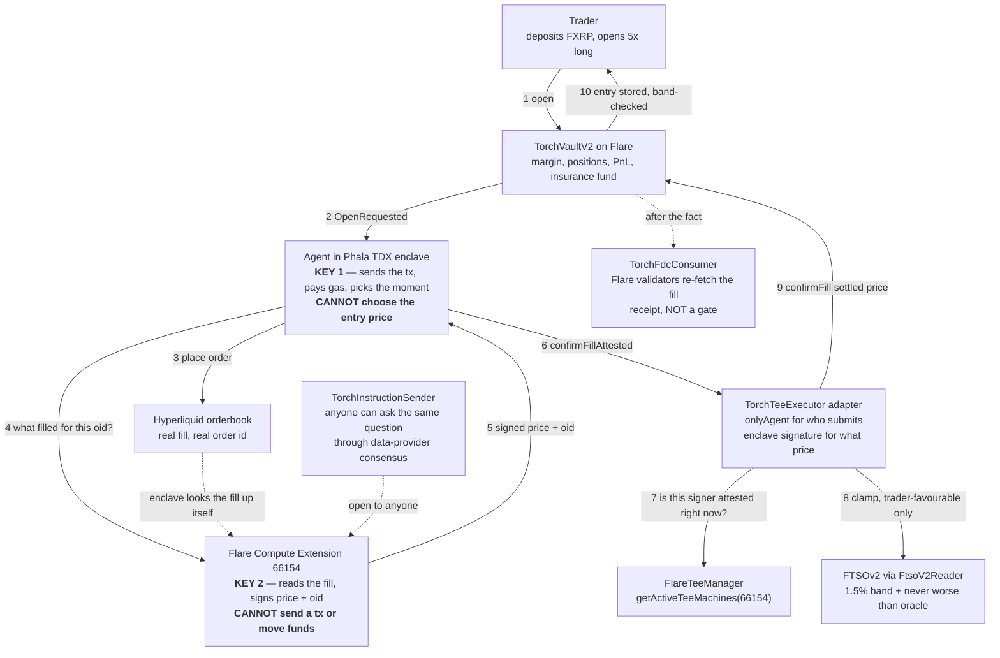

# Torch

**Perpetual futures margined in XRP, settled on Flare, where you can check the price you were filled at.**

**Live on Flare Coston2 testnet: https://usetorch.xyz** — take free C2FLR and FTestXRP from the [Flare faucet](https://faucet.flare.network), deposit, trade. Three minutes, costs nothing.

**Who it's for:** XRP holders. One of crypto's largest idle asset bases, with no perps venue that takes their asset as margin, settles back into it, and shows its work.

**The gap Torch closes.** FXRP-margined perps already exist on Flare — [SparkDEX Eternal](https://flare.network/news/sparkdex-eternal-brings-perpetuals-to-flare) takes FXRP as collateral. So the question is not *"can you trade with XRP."* It is **"can you check the trade was honest."** Every perp venue with an off-chain execution leg has one number that is purely the operator's word: the price you got filled at.

**What Torch does about it.** As of Aug 12 2026, on venue-routed markets, an entry price cannot reach the vault unless a **Flare Confidential Compute enclave signed it** after reading the fill on the exchange itself — and the vault's adapter checks that signer against `FlareTeeManager.getActiveTeeMachines(66154)` on every single call. The operator's agent still sends the transaction and pays the gas. It can no longer choose the number inside it.

Check that claim before reading further: call [`TorchVaultV2.executor()`](https://coston2-explorer.flare.network/address/0x8d9A6a11BcC64CC36e54b22ACa68865d759fa6Bd#readContract). It returns `0xad5b7703…` — the [TorchTeeExecutor](https://coston2-explorer.flare.network/address/0xad5b7703C5E201DAE04D3F41D4338fAa93eA641f) adapter, not an operator key.

**Traction, all on-chain:** two Paper Perps League seasons. The retired v1 vault holds 28 depositor wallets, 26 traders and **221 positions** (`positionsCount()` on [`0x7fC640Bd…`](https://coston2-explorer.flare.network/address/0x7fC640Bd0e635a6AFc3B437e80f0DE192f6FA0BA#readContract)). The live v2 vault is at **25** and counting (`positionsCount()`, indices 0–24).

---

## One live trade, start to finish

Position **#21**, BTC long, opened and closed on Coston2 today. Three transactions, all from the enclave-held agent key, all readable now:

| Step | What happened | Receipt |
|---|---|---|
| 1. Accept | Agent claims the open request | read `getPosition(21)` on the vault |
| 2. Fill on Hyperliquid | Real order on the testnet book, order id `57757222726` | HL `/info` → `userFills`, account below |
| 3. **Attested confirm** | `confirmFillAttested(21, 63953.000000, 57757222726, sig)` — adapter recovers the signer, asks Flare's TEE registry if it is attested *right now*, burns the oid against replay, clamps to FTSO, then calls the vault | read `getPosition(21)` on the vault |
| 4. Close | Settled at 64199.680000, **+0.617808 FXRP** to the trader | read `getPosition(21)` on the vault |

Open to close: 21 seconds (`openedAt` 1786536649 → `closedAt` 1786536670).

The `FillConfirmedFromTee` log in step 3 emits both numbers and the signer:

```
attestedPrice6 = 63953000000   (what the enclave saw on the venue)
settledPrice6  = 63953000000   (what the vault stored, after the oracle clamp)
hlOid          = 57757222726
attestor       = 0xc38Ae007ffe51Ff90f4B94d4F78BdbCa74241290
```

That attestor address is not one we wrote down. Call [`FlareTeeManager.getActiveTeeMachines(66154)`](https://coston2-explorer.flare.network/address/0x1a9C4A0f9D76c0b1D91d22E24E573a9b377618aE#readContract) and you get exactly that address back. The chain, not the README, decides which enclave the vault trusts — which matters, because an FCE's key does not survive a restart, so a pinned address would be silently wrong forever after the first one.

**Four one-click checks, no trust required:**

| Call | Returns | Meaning |
|---|---|---|
| `TorchVaultV2.executor()` | `0xad5b7703…` | entry prices go through the adapter, not an EOA |
| `TorchTeeExecutor.agent()` | `0x972709786ef35F88F5D13D10cc27d9621E0ea560` | the same address the [Phala enclave status endpoint](https://cc1525a5ca15c4c8ef2668e72bc888f5a0c3239a.dstack-pha-prod9.phala.network) publishes as its executor |
| `TorchTeeExecutor.oidUsed(57757222726)` | `true` | that exchange order id was consumed by an attested confirm, and can never be reused |
| `TorchVaultV2.maxDeviationBps()` | `150` | every settlement reverts more than 1.5% off the FTSOv2 feed |

Earlier attested lifecycle, same shape: position **#20**, entry 63934.0, oid `57756491649` (`oidUsed` → `true`), closed. The signature-verification path is also reproducible standalone against a mock sink — [`0x341a670d…`](https://coston2-explorer.flare.network/tx/0x341a670d45dca72ff5ff164481441e4f22c53c0ffcfe014ec4c3591d143b9162), via [`scripts/proveTeeSignature.ts`](contracts/scripts/proveTeeSignature.ts) — so anyone can re-run it without touching a live position.

---

## How a trade actually flows



### The two keys, and what each one cannot do

|  | **Phala enclave** (Intel TDX) | **Flare Compute Extension** (FCE 66154) |
|---|---|---|
| Holds | the executor key that sends transactions | the key that signs fill prices |
| Can | submit to the chain, pay gas, pick the moment | read Hyperliquid and state what filled |
| **Cannot** | **choose the entry price** | **send a transaction, or move any funds** |
| Attested by | real Intel TDX hardware; image digest published at the status endpoint | Flare's data providers, on-chain registry |
| Chain checks it via | `onlyAgent` | `getActiveTeeMachines(66154)` |

Neither key alone can open a position at a price of its choosing. That separation is the whole Confidential Compute argument, and it is enforced in [TorchTeeExecutor.sol](contracts/contracts/TorchTeeExecutor.sol), not asserted in prose.

**The clamp.** Hyperliquid does not track FTSO exactly — tens of basis points of drift — so a genuine venue fill lands on the wrong side of the vault's never-worse-than-oracle guard about half the time. The agent used to absorb that privately by reporting the trader-favourable side. Now the adapter does it on-chain: it stores the better of (enclave-signed venue price, oracle price) for the trader, and emits both. It can only ever move a price in the trader's favour, and a fabricated venue price still needs an enclave signature.

**One honest design note.** The live agent asks the extension directly over HTTP (~1s) rather than through the on-chain consensus relay (~one voting round). The relay decides *who may ask*, not *whether the answer is true* — the enclave looks the fill up on the exchange itself, and the chain checks the signature either way. The relayed path stays open to anyone who wants to reproduce the answer independently: that is what [`TorchInstructionSender`](https://coston2-explorer.flare.network/address/0x88d0c142844C418ae27e9B4bd730376ee7F3799b) is for. A live relayed round trip: [`0x1d84be38…`](https://coston2-explorer.flare.network/tx/0x1d84be384922252f1eb7e3acf89a24248b5b1871b2845f84f7f5bcc2e5d63f2c).

---

## Why Flare, specifically

Five Flare protocols, each load-bearing. Remove any one and something concrete breaks.

- **Flare Confidential Compute** — extension `66154`, op `TORCH`/`ATTEST_FILL`. Decides the entry price from what actually filled. Without it, the entry price is the operator's word. *(Details: [fce/](fce/README.md))*
- **FTSOv2** — every settlement bounded on-chain at 1.5% (`maxDeviationBps() == 150`), plus never-worse-than-oracle, plus a fresh oracle read at liquidation. Out-of-band prices revert. Feeds resolve through `ContractRegistry`, so an FtsoV2 redeploy is picked up with no action from us.
- **FAssets / FXRP** — the margin and settlement asset. This is what makes it *XRP* perps rather than another USDC venue.
- **FDC / Web2Json** — the enclave runs the round trip itself for every venue-routed fill, binding the exchange order id to the position on-chain, with URL, body, method, headers, JQ and ABI signature all pinned. Receipts: [`0x32cb4534…`](https://coston2-explorer.flare.network/tx/0x32cb45341a5fe466609a389029d93850b9a248872a6e4cc63b33b6966527b71a), [`0xfb3a9222…`](https://coston2-explorer.flare.network/tx/0xfb3a92226ede6af25abe3264588c99ed00575698c65093cdd88b8d6980b57bd2).
- **Flare Smart Accounts** — one XRPL signature mints FXRP, approves it, and deposits it as margin, atomically in a single Coston2 transaction. No EVM wallet, no gas, no bridge UI, zero vault changes: [the XRPL signature](https://testnet.xrpl.org/transactions/BE8301336DA71C7B488BDC0C1006051599E439D50FC2F492CB334659766B94F7) → [the Coston2 execute tx](https://coston2-explorer.flare.network/tx/0xbaf5241608039406d307cdb46a6fcd1a55ad42b3fd31608bf077dd12b0298fee). Write-up: [`spikes/fsa-one-signature-margin/`](spikes/fsa-one-signature-margin/README.md).

**In one line:** Flare is the market, FTSO is the settlement judge, FCC decides the entry price, FDC is the audit trail, and Hyperliquid is borrowed liquidity. Your trade — entry, exit, PnL, liquidation — settles on Flare in FXRP, always. You never hold a Hyperliquid account, never touch USDC, never leave Flare. Hyperliquid is where *the house* hedges its own exposure.

---

## Live contracts (Coston2, chain id 114)

| Contract | Address |
|---|---|
| **TorchVaultV2** — margin, positions, PnL, insurance fund | [`0x8d9A6a11BcC64CC36e54b22ACa68865d759fa6Bd`](https://coston2-explorer.flare.network/address/0x8d9A6a11BcC64CC36e54b22ACa68865d759fa6Bd#code) *(source-verified)* |
| **TorchTeeExecutor** — the vault's executor; verifies enclave signatures, clamps to FTSO | [`0xad5b7703C5E201DAE04D3F41D4338fAa93eA641f`](https://coston2-explorer.flare.network/address/0xad5b7703C5E201DAE04D3F41D4338fAa93eA641f) |
| **TorchInstructionSender** — on-chain FCE entry point, permissionless | [`0x88d0c142844C418ae27e9B4bd730376ee7F3799b`](https://coston2-explorer.flare.network/address/0x88d0c142844C418ae27e9B4bd730376ee7F3799b) |
| **FCE machine** (extension `66154`) | `0xc38Ae007ffe51Ff90f4B94d4F78BdbCa74241290` — from [`FlareTeeManager`](https://coston2-explorer.flare.network/address/0x1a9C4A0f9D76c0b1D91d22E24E573a9b377618aE#readContract) |
| **FtsoV2Reader** — resolves FTSOv2 through `ContractRegistry` on every read | [`0xF8be9ca7bCb07B0e87BDcEAB28841fF6A16E7D01`](https://coston2-explorer.flare.network/address/0xF8be9ca7bCb07B0e87BDcEAB28841fF6A16E7D01#code) *(source-verified)* |
| **TorchFdcConsumer** — FDC/Web2Json fill attestation | [`0xe3B21cbD82dcc4acD4BFDAC5Ee61AC1E2B9F2a6f`](https://coston2-explorer.flare.network/address/0xe3B21cbD82dcc4acD4BFDAC5Ee61AC1E2B9F2a6f#code) *(source-verified)* |
| **FXRP** (FTestXRP), 6 decimals | [`0x0b6A3645c240605887a5532109323A3E12273dc7`](https://coston2-explorer.flare.network/address/0x0b6A3645c240605887a5532109323A3E12273dc7) |
| Phala TDX enclave (agent key `0x9727…a560`) | [status endpoint](https://cc1525a5ca15c4c8ef2668e72bc888f5a0c3239a.dstack-pha-prod9.phala.network) — publishes executor address, execution mode, image digest, loop health |
| TorchVault **v1**, retired — 28 depositors, 26 traders, 221 positions, still readable | [`0x7fC640Bd0e635a6AFc3B437e80f0DE192f6FA0BA`](https://coston2-explorer.flare.network/address/0x7fC640Bd0e635a6AFc3B437e80f0DE192f6FA0BA) |

Markets: XRP, BTC, ETH, SOL, HYPE, DOGE, up to 10x. Fees: 8 bps open, 8 bps close, 100 bps liquidation, paid in FXRP to the treasury (`openFeeBps` / `closeFeeBps` / `liquidationFeeBps`, readable on the vault). Hyperliquid demo account `0xfDb941fe97e13B599BC576c4142128aB97D01622` — query `userFills` against the public `/info` endpoint and check our fills yourself.

---

## What is NOT proven

This is v0: a **verifiable operator**, not a trustless protocol. Everything below is a real limitation, stated in plain language. The [Verify page](https://usetorch.xyz/verify) says the same.

1. **Only the entry price is enclave-gated. The exit is not.** A close carries no exchange order id, so there is nothing for the enclave to look up. Your exit price — the one that actually sets your PnL — is still operator-reported, bounded only by the FTSO 1.5% band and the never-worse-than-oracle rule. This is the single biggest remaining gap.
2. **The FCE runs `SIMULATED_TEE=true` on Coston2.** This is what Flare's own guides prescribe for Coston2 development, and Flare DevRel confirmed it qualifies. The chain, the registration, and the data-provider consensus are real; **the hardware quote is simulated**. No Confidential Space VM is involved. The Phala CVM is the real-hardware half (Intel TDX, key generated inside the enclave, image pinned by digest).
3. **The owner key can undo all of this, with no timelock.** Owner `0x3c343aD077983371b29FeE386bDbC8a92E934C51` (same EOA on the vault and the adapter) can repoint the oracle, repoint the executor away from the adapter, and withdraw from the insurance fund. One `setExecutor` call turns the enclave gate off. No timelock, no multisig, no quorum today.
4. **FDC attestations are receipts, not preconditions.** No vault code path reads the FDC consumer. They prove Flare's validators re-fetched the exchange and found the recorded order id in our account with the right market and side — they do **not** compare price, size or timestamp to the position, and they cover the entry fill only. A round trip takes ~2 minutes, so requiring one inline would stall the loop.
5. **Hyperliquid testnet does not list XRP.** The flagship market fills at the FTSO mark with `oid 0`: unhedged, insurance-carried, and with nothing to attest — no enclave signature, no FDC receipt. Venue-listed markets (BTC, ETH, and the rest) route to the real book.
6. **Winning payouts are capped at the insurance fund balance** (`PayoutCapped`). Read `insuranceFund()` on the vault for the live figure — on testnet it is deliberately small (~27.9 FXRP at time of writing) and shrinks as winners draw on it. The order ticket warns before you size into the cap. Losses accrue to the fund.
7. **The house hedge is manual at the edges.** Venue-vs-oracle basis inside the FTSO band is carried by the operator, never the user — but moving hedge PnL back into the on-chain insurance fund is an operator step today, not an automatic bridge.
8. **Stop-loss and take-profit are instructions, not guarantees.** The contract re-reads FTSOv2 and refuses an uncrossed trigger, so the executor cannot fire one early — but only the executor can fire one at all. A stalled agent means your stop does not fire. A fired trigger settles at the oracle mark at that moment, not the number you typed. The two-hour self-close escape covers a close you already requested, not an untouched trigger.
9. **The Hyperliquid API key is operator-provisioned.** It is an API wallet — it can trade, it can never withdraw — but it is not a key nobody has seen. The key nobody has seen is the executor key that signs transactions, generated inside the Phala enclave.
10. **Not audited. Testnet software.** Open items for production: funding rates, partial closes, multi-executor quorum, withdrawal timelocks, and reading FDC proofs inside settlement.

---

## Revenue

Two rails, both in the code. **Vault fees are live on-chain today**: 8 bps open, 8 bps close, 100 bps liquidation, in FXRP, routed to the treasury in every case. Revenue scales with exactly one thing — FXRP margin volume — so Torch's revenue metric *is* Flare's FXRP-adoption metric. **Hyperliquid builder codes are wired but never exercised**: `HL_BUILDER_ADDRESS` is unset in the live deployment, and today the only flow through Hyperliquid is the house's own hedge, where a builder fee would be circular. Turning it on is a config flag and a one-time `approveBuilderFee`. No token, no yield promises.

## Repo

```
contracts/   Hardhat: TorchVaultV2, TorchTeeExecutor, TorchFdcConsumer, FtsoV2Reader, deploy + FDC scripts
agent/       TypeScript executor: watches the vault, fills on the venue, asks the enclave, liquidates
fce/         the Flare Compute Extension (Go) + TorchInstructionSender  →  fce/README.md
web/         Vite + React trading terminal (wagmi v2, viem, lightweight-charts)
spikes/      Flare Smart Accounts: one XRPL signature → FXRP margin
```

Run the whole thing locally against a mock chain and a random-walk oracle (Node 22+, npm 10+):

```bash
npm install
npm run chain                          # terminal A
npm run deploy:local && npm run agent  # terminal B
npm run web                            # terminal C → http://localhost:5173
npm run smoke -w contracts             # scripted proof of the same journey
```

Independent FDC check, permissionless, no operator involved: `POSITION_ID=<id> npm run fdc:attest -w contracts`.

Roadmap and status detail: [ROADMAP.md](ROADMAP.md). Built for the Flare Summer Signal hackathon, entering both bounties — Interoperable Asset Products and Confidential Compute Apps.

## License

MIT
